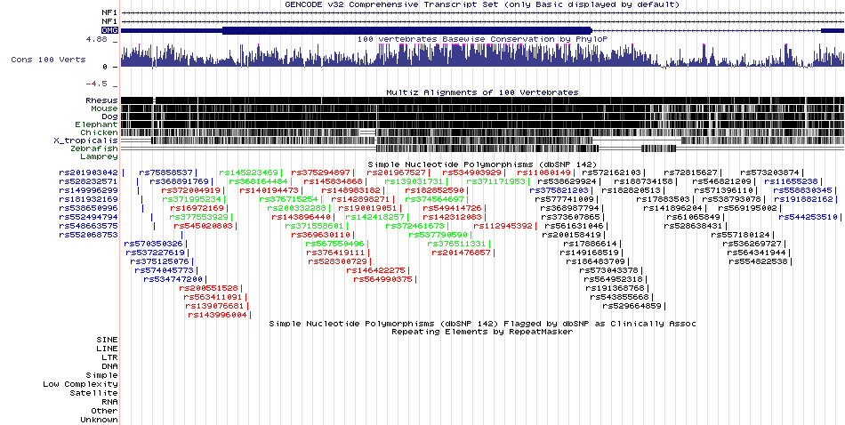
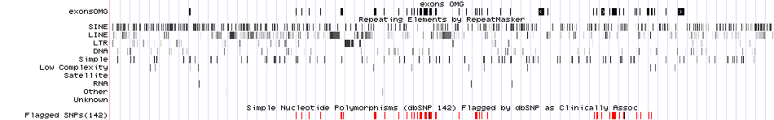
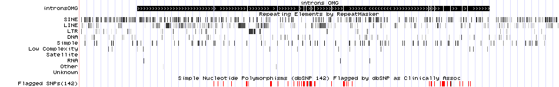

## Цели : 

Проанализировать геном бактерии **Desulforudis audaxviator**, ответив на вопросы

1. Какова длина генома
2. Сколько генов, кодирующих белки
3. Сколько рнк-генов
4. Сколько транскрипционных факторов
5. Сколько транспортных белков
6. Сколько tRNA
7. Сколько закодировано субъединиц ATP-synthase
8. Сколько геномов закодировано на положительном, а сколько на отрицательном стренде

Проанализировать геном **OMG**, ответив на вопросы

1. Рассмотреть все изоформы гена и предстваить их в виде графического файла
2. Рассмотреть все изоформы гена и предстваить их в виде текстового файла
3. Отобразить координаты только экзонов и только интронов
4. Выяснить, в какие участки гена попадают clinically relevant SNPs
5. Выяснить, в какие участки гена попадают транспозоны

## О данных :

Данные используемые в данной работе взяты с сайта Национального центра биотехнической информации США [NCBI](https://www.ncbi.nlm.nih.gov/).
Данные об исследуемой бактерии представляются в формате TSV(tab-separated value) и сжаты в gunzip, могут быть скачаны с 
[Desulforudis audaxviator](ftp://ftp.ncbi.nlm.nih.gov/genomes/refseq/bacteria/Candidatus_Desulforudis_audaxviator/).

Также доступна [документация](ftp://ftp.ncbi.nlm.nih.gov/genomes/refseq/bacteria/Candidatus_Desulforudis_audaxviator/README.txt) к данной датабазе.


### Установим глобальны параметр :

Установим echo=TRUE чтобы весь код был представлен в финальном отчете.


```r
knitr::opts_chunk$set(echo = TRUE)
```

Загрузка библиотек необходимых в анализе


```r
library(R.utils)
library(data.table)
library(ggplot2)
library(Biostrings)
library(stringr)
library(readr)
```

## Обработка Данных генома бактерии:

### Скачивание и Чтение :

1. Проверка существования **GCF_000018425.1_ASM1842v1_genomic.fna.gz** и **GCF_000018425.1_ASM1842v1_feature_table.txt.gz** и их скачивание в случае отсутствия.


```r
if (!file.exists("GCF_000018425.1_ASM1842v1_genomic.fna.gz")) {
     fileUrl1<-"ftp://ftp.ncbi.nlm.nih.gov/genomes/refseq/bacteria/Candidatus_Desulforudis_audaxviator/latest_assembly_versions/GCF_000018425.1_ASM1842v1/GCF_000018425.1_ASM1842v1_genomic.fna.gz"
     download.file(fileUrl1, destfile = "./GCF_000018425.1_ASM1842v1_genomic.fna.gz")
     
     if (!file.exists("GCF_000018425.1_ASM1842v1_genomic.fna.gz")) {
          stop("Can't locate file 'GCF_000018425.1_ASM1842v1_genomic.fna.gz'!")
     }
}


if (!file.exists("GCF_000018425.1_ASM1842v1_feature_table.txt.gz")) {
     fileUrl2<-"ftp://ftp.ncbi.nlm.nih.gov/genomes/refseq/bacteria/Candidatus_Desulforudis_audaxviator/latest_assembly_versions/GCF_000018425.1_ASM1842v1/GCF_000018425.1_ASM1842v1_feature_table.txt.gz"
     download.file(fileUrl2, destfile = "./GCF_000018425.1_ASM1842v1_feature_table.txt.gz")
     
     if (!file.exists("GCF_000018425.1_ASM1842v1_feature_table.txt.gz")) {
          stop("Can't locate file 'GCF_000018425.1_ASM1842v1_feature_table.txt.gz'!")
     }
}
```

2. Проверка существования распакованных данных (для сохранения времени на распаковку) и их распаковка в случае отсутствия


```r
Genname <- "GCF_000018425.1_ASM1842v1_genomic.fna.gz"
Gendest <- "GCF_000018425.1_ASM1842v1_genomic.fna"
if(!file.exists("GCF_000018425.1_ASM1842v1_genomic.fna")){
  gunzip(Genname,Gendest,overwrite=TRUE,remove=FALSE)
}

Tblname <- "GCF_000018425.1_ASM1842v1_feature_table.txt.gz"
Tbldest <- "GCF_000018425.1_ASM1842v1_feature_table.txt"
if(!file.exists("GCF_000018425.1_ASM1842v1_feature_table.txt")){
  gunzip(Tblname,Tbldest,overwrite=TRUE,remove=FALSE)
}
```

3. Чтение **GCF_000018425.1_ASM1842v1_feature_table.txt**

```r
TblLines = readLines("GCF_000018425.1_ASM1842v1_feature_table.txt")
```

### Обработка Данных:
Измерим длину последовательности, используя функцию **fasta.seqlengths** библиотеки **Biostrings**

```r
fasta.seqlengths(file = "GCF_000018425.1_ASM1842v1_genomic.fna", nrec=-1L, skip=0L, seek.first.rec=FALSE, seqtype="B", use.names=TRUE)
```

```
## NC_010424.1 Candidatus Desulforudis audaxviator MP104C, complete sequence 
##                                                                   2349476
```

Посчитаем количество генов, кодирующих белки, посчитав количество строк в которых встречается **protein_coding**

```r
sum(grepl(pattern = "protein_coding", x = TblLines))
```

```
## [1] 2235
```

Посчитаем количество рнк-генов, найдя строки содержащие **ncRNA, tRNA, rRNA, tmRNA**

```r
ncRNA <- sum(grepl(pattern = "ncRNA", x = TblLines))
tRNA <- sum(grepl(pattern = "tRNA", x = TblLines))
rRNA <- sum(grepl(pattern = "rRNA", x = TblLines))
tmRNA <- sum(grepl(pattern = "tmRNA", x = TblLines))
sum(ncRNA, tRNA, rRNA, tmRNA)
```

```
## [1] 172
```

Посчитаем количество транскрипционных факторов, то есть строк, содержащих **transcriptional regulator**

```r
sum(grepl(pattern = "transcriptional regulator", x = TblLines))
```

```
## [1] 34
```

Посчитаем количество транспортных белков, посчитав количество строк с **ABC transporter**

```r
sum(grepl(pattern = "ABC transporter", x = TblLines))
```

```
## [1] 59
```

Посчитаем количество **tRNA**

```r
sum(grepl(pattern = "tRNA", x = TblLines))
```

```
## [1] 142
```

Посчитаем количество закодированных субъединиц **ATP synthase**

```r
sum(grepl(pattern = "ATP synthase", x = TblLines))
```

```
## [1] 10
```

Посчитаем количество генов закодированных на *положительном стренде*, то есть количество строк содержащих **gene** и **+**, для этого рассмотрим пересечение множеств строк, содержащих **gene** и строк, содержащих **+**.
Затем посчитаем количество генов закодированных на *отрицательном стренде*, проведя аналогичную операцию с **gene** и **-**.

```r
length(intersect(
  grep(pattern = "gene", x = TblLines),
  grep(pattern = "\\+", x = TblLines)
  )
)
```

```
## [1] 1154
```

```r
length(intersect(
  grep(pattern = "gene", x = TblLines),
  grep(pattern = "\\-", x = TblLines)
  )
)
```

```
## [1] 1195
```


## Обработка данных гена человека

Отобразим аннотацию генами UCSC, all SNPs(142), Flagged SNPs(142), RepeatMsker, Conservation


Далее мы получим изоморфы генов, пользуясь Table Browser, а также координаты интронов и экзонов и сохраним их в приложеный txt файл. 

Отобразим их(интроны и экзоны) на графике с Flagged SNPs(142) и RepeatMascer, добавив их как custom track.






Можно заметить, что Flagged SNP попадает на экзоны, а RepeatMascer как на экзоны, так и на интроны


