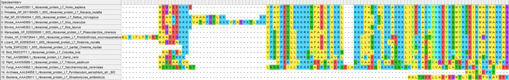
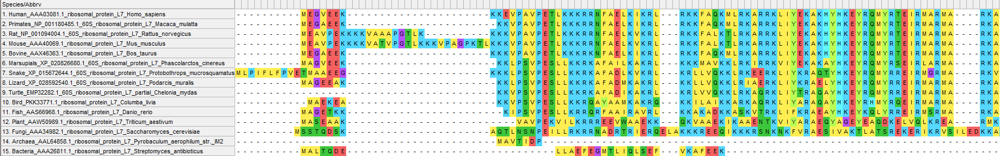

## Цели : 

## О данных :

Данные используемые в данной работе взяты с сайта Национального центра биотехнической информации США [NCBI](https://www.ncbi.nlm.nih.gov/).
Данные об исследуемом белке могут быть найдены через поисковит белков [NCBI](https://www.ncbi.nlm.nih.gov/protein/)

Также доступна [документация](https://www.ncbi.nlm.nih.gov/guide/proteins/#howtos).

## Обработка аминокислотной последовательности:

### Скачивание:

Скачаем последовательности в формате FASTA с NCBI:

1. Человек [Homo sapiens](https://www.ncbi.nlm.nih.gov/protein/AAA03081.1)
2. Обезьяна [Macaca mulatta](https://www.ncbi.nlm.nih.gov/protein/NP_001180485.1)
3. Крыса [Rattus norvegicus](https://www.ncbi.nlm.nih.gov/protein/NP_001094004.1)
4. Мышь [Mus musculus](https://www.ncbi.nlm.nih.gov/protein/AAA40069.1)
5. Копытное [Bos taurus](https://www.ncbi.nlm.nih.gov/protein/AAX46363.1)
6. Сумчатое [Phascolarctos cinereus](https://www.ncbi.nlm.nih.gov/protein/XP_020826680.1)
7. Змея [Protobothrops mucrosquamatus](https://www.ncbi.nlm.nih.gov/protein/XP_015672644.1)
8. Ящерица [Podarcis muralis](https://www.ncbi.nlm.nih.gov/protein/XP_028592540.1)
9. Черепаха [Chelonia mydas](https://www.ncbi.nlm.nih.gov/protein/EMP32282.1)
10. Птица [Columba livia](https://www.ncbi.nlm.nih.gov/protein/PKK33771.1)
11. Рыба [Danio rerio](https://www.ncbi.nlm.nih.gov/protein/AAS66968.1)
12. Растение [Triticum aestivum](https://www.ncbi.nlm.nih.gov/protein/AAW50989.1)
13. Пекарские дрожжи [Saccharomyces cerevisiae](https://www.ncbi.nlm.nih.gov/protein/AAA34982.1)
14. Архея [Pyrobaculum aerophilum](https://www.ncbi.nlm.nih.gov/protein/AAL64858.1)
15. Бактерия [Streptomyces antibioticus](https://www.ncbi.nlm.nih.gov/protein/AAA26811.1)

### Выравнивание

Выравнием последовательности методом ClustalW и Muscle, получим выровненные последовательности [ClustalW](https://drive.google.com/file/d/1HtNPjupakaTaff6-jQJAMWBIQIxa2x7V/view?usp=sharing) и [Muscle](https://drive.google.com/file/d/1UYL78IIqOBh-07wvJQBQxqB1CJfv0uhB/view?usp=sharing), заметим что они отличаются.

### Деревья
Построим деревья, используя MEGA X 3 методами

#### ClustalW

[UPGMA](https://drive.google.com/file/d/1hPpDUa9uJmDLcnrepNsUhFL9HPq9cWZD/view?usp=sharing)

[Neighbor joining](https://drive.google.com/file/d/1fIEN3s1rEiak2htmVUBiG3kB9EShOhEs/view?usp=sharing)

[Maximum likelihood](https://drive.google.com/file/d/1OAH_Js0PMo2zVixTMYlEwZyR-ohE5Rn8/view?usp=sharing)

#### Muscle

[UPGMA](https://drive.google.com/file/d/11cxH8ehwfc-_q8jbqnSrhElHRs3Ktvhq/view?usp=sharing)

[Neighbor joining](https://drive.google.com/file/d/1wzBnoBK5oBEDgvbvZISxCxtlgAArmOFH/view?usp=sharing)

[Maximum likelihood](https://drive.google.com/file/d/1Mw3AzA7iSqX0yH_KnsdqV6_m5NO675vo/view?usp=sharing)

