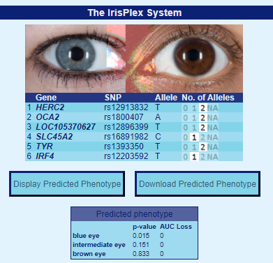

### Цели : 

Рассмотреть [базу по генотипированию](https://opensnp.org/data/10095.23andme.8356?1612170074) пользователя [tundra9910](https://opensnp.org/users/10095) и выполнить следующие задания для нее:

##### Задание 1:
  1. Определить цвет глаз, используя [IrisPlex](https://hirisplex.erasmusmc.nl/)
  2. Определить степень риска тромбоза
  3. Рассмотреть несколько (хотя бы 3) признаков и проверить 
  
### Обработка:

Загрузим используемые библиотеки

```{r setoptions, warning=FALSE,message=FALSE}
knitr::opts_chunk$set(echo = TRUE)
```

```{r load_library,warning=FALSE,message=FALSE}
Sys.setlocale(category = "LC_ALL", locale = "Russian")

library(readr)
library(ggplot2)
library(dplyr)
library(gwascat)
library(stringr)
library(kableExtra)
library(tidystringdist)
library(tidyverse)
```

Скачаем базу 23 and Me с [Opensnp](https://opensnp.org/users/10095) и прочтем ее

```{r read}
genome_raw <- read_tsv("10095.23andme.8356", skip = 19, col_types = cols(
 `# rsid` = col_character(),
 chromosome = col_character(),
 position = col_integer(),
 genotype = col_character())
 )

genome_raw <- rename(genome_raw, rsid = `# rsid`)
```

Рассмотрим полученные данные

```{r head}
head(genome_raw)
```
<br/>
**rsid** -- уникальный номер, используемый для идентификация различных SNP (Single Nucleotide Polymorphism). Сама аббревиатура происходит от Reference SNP cluster ID 
<br/><br/>

##### Пункт 1
Чтобы узнать цвет глаз, необходимо найти значения при **rs12913832, rs1800407, rs12896399, rs16891982, rs1393350, rs12203592** и внести их в таблицу [IrisPlex](https://hirisplex.erasmusmc.nl/), это можно сделать как вручную, сделав поиск по базе, так и используя *grepl* и *filter*
```{r eyes}
dplyr::filter(genome_raw, grepl('\\brs12913832\\b|\\brs1800407\\b|\\brs12896399\\b|\\brs16891982\\b|\\brs1393350\\b|\\brs12203592\\b', rsid))
```

Теперь мы можем подставить значения и узнать цвет глаз, внеся количество соответствующих аллелей в систему, мы получим:
<br/>

<br/>
То есть у рассматриваемого человека вероятнее всего карие глаза
<br/><br/><br/>

##### Пункт 2
Далее узнаем вероятность тромбоза, рассмотрев **rs6025** (F5, factor V Leiden), **rs1799963** (F2, 20210 G > A), **rs8176719** (ABO), **rs2066865** (FGG, 10034 C > T), **rs2036914** (F11) 
```{r clot}
dplyr::filter(genome_raw, grepl('\\brs6025\\b|\\brs1799963\\b|\\brs8176719\\b|\\brs2066865\\b|\\brs2036914\\b', rsid))
```
Исходя из статьи [Multiple SNP testing improves risk prediction of first venous thrombosis](https://ashpublications.org/blood/article/120/3/656/30474/Multiple-SNP-testing-improves-risk-prediction-of) можно выяснить, что рискованными являются **rs6025 - AA, rs1799963 - AA, rs8176719 - GG, rs2066865 - TT, rs2036914 - CC** и у рассматриваемого человека генотип **rs2036924** рискованный.
<br/><br/><br/> 


##### Пункт 3
вернемся к датабазе
23 and Me имеет SNP, которых может не быть в GWAS базе, которую мы используем (gwascat -- пакет R, служащий интерфейсом к базе даных [NHGRI](https://www.genome.gov/), в которую занесены различные работы, изучающие связи генов с заболеваниями и другими характеристиками).
<br/> 
Скачаем базу NHGRI
```{r gwas,warning=FALSE,message=FALSE}
updated_gwas_data <- as.data.frame(makeCurrentGwascat())
```

Объединим ее с имеющейся базой, зная, что **rsid** и **SNP** это одно и то же
```{r jpin_data}
join_data <- inner_join(genome_raw, 
                        updated_gwas_data, 
                        by = c("rsid" = "SNPS"))
```

Разделим генотип на группы (separate fields) 
```{r cleaning}
join_data$risk_allele_clean <- str_sub(join_data$STRONGEST.SNP.RISK.ALLELE, -1)
join_data$my_allele_1 <- str_sub(join_data$genotype, 1, 1)
join_data$my_allele_2 <- str_sub(join_data$genotype, 2, 2)
join_data$have_risk_allele_count <- if_else(
  join_data$my_allele_1 == join_data$risk_allele_clean, 1, 0) + 
  if_else(
    join_data$my_allele_2 == join_data$risk_allele_clean, 1, 0)
```

Избавимся от аллелей, с которыми ничего не связано
```{r selecting}
risk_data<- select(join_data,
       have_risk_allele_count,
       rsid,
       my_genotype = genotype,
       risk_allele = risk_allele_clean,
       DISEASE.TRAIT,
       MAPPED_TRAIT,
       RISK.ALLELE.FREQUENCY,
       REPORTED.GENE.S.) %>%
filter(have_risk_allele_count>0)
```

Рассмотрим 
```{r count,warning=FALSE,message=FALSE}
#Количество признаков заболеваний или других характеристик
trait_count_mapped <- risk_data %>%
  group_by(MAPPED_TRAIT) %>%
  summarise(risk_count = n()) 

#Количество признаков заболеваний или других характеристик для рискованной аллели = 2
trait_count_mapped2 <- risk_data %>%
  group_by(MAPPED_TRAIT, have_risk_allele_count) %>%
  filter(have_risk_allele_count==2) %>%
  summarise(risk_count_2 = n()) %>%
 subset(select = -c(have_risk_allele_count))

#Объединим risk counts для аллелей =1 и аллелей = 2
trait_count_mapped3<- 
  merge(trait_count_mapped, trait_count_mapped2, 
        by = c("MAPPED_TRAIT", "MAPPED_TRAIT"),all=TRUE) 

trait_count_mapped3[is.na(trait_count_mapped3)] <- 0

#Risk count для уравнения Allele_1
risk_1 <- (trait_count_mapped3$risk_count - trait_count_mapped3$risk_count_2)

#Добавим risk_1 
trait_count_mapped4 <- select(trait_count_mapped3,
  MAPPED_TRAIT,
  risk_count,
  risk_count_2
)%>%
  mutate(risk_1
         )
#Добавим Overall Risk
overall_risk <- (trait_count_mapped3$risk_count_2 / ((trait_count_mapped3$risk_count_2 + trait_count_mapped4$risk_1*2)))+(trait_count_mapped4$risk_1/((trait_count_mapped3$risk_count_2+trait_count_mapped4$risk_1*2)))

overall_risk_count <- select(trait_count_mapped4,
       MAPPED_TRAIT,
       risk_count,
       risk_1,
       risk_count_2,
       ) %>%
  mutate(overall_risk*100) 

overall_risk_count[is.na(overall_risk_count)] <- 0


#Получим число признаков заболеваний или других характеристик через DISEASE.TRAIT
trait_count_disease <- risk_data %>%
  group_by(DISEASE.TRAIT)%>%
  summarise(risk_count= n())

#Посчитаем число признаков заболеваний или других характеристик для Risk Allele = 2
trait_count_disease2 <- risk_data %>%
  group_by(DISEASE.TRAIT, have_risk_allele_count) %>%
  filter(have_risk_allele_count==2) %>%
  summarise(risk_count_2 = n()) %>%
 subset(select = -c(have_risk_allele_count))

#Объединим Risk Counts для однинарной и парной рискованной аллели
trait_count_disease3<- 
  merge(trait_count_disease, trait_count_disease2, 
        by = c("DISEASE.TRAIT", "DISEASE.TRAIT"),all=TRUE) 

trait_count_disease3[is.na(trait_count_disease3)] <- 0

#Посчитаем риск для одинарных рискованных аллелей
risk_d_1 <- (trait_count_disease3$risk_count - trait_count_disease3$risk_count_2)

#Добавим risk_1
trait_count_disease4 <- select(trait_count_disease3,
  DISEASE.TRAIT,
  risk_count,
  risk_count_2
)%>%
  mutate(risk_d_1
         )
#Посчитаем общий риск
overall_risk_d <- (trait_count_disease3$risk_count_2 / ((trait_count_disease3$risk_count_2 + trait_count_disease4$risk_d_1*2)))+(trait_count_disease4$risk_d_1/((trait_count_disease3$risk_count_2+trait_count_disease4$risk_d_1*2)))

overall_risk_count_d <- select(trait_count_disease4,
       DISEASE.TRAIT,
       risk_count,
       risk_1= "risk_d_1",
       risk_count_2,
       ) %>%
  mutate(overall_risk_d*100) 

overall_risk_count[is.na(overall_risk_count)] <- 0
```
<br/> 
При замене **DISEASE.TRAIT** на **MAPPED_TRAIT** мы можем избавиться от избыточных записей.
<br/>
<br/>
Далее мы будем использовать обозначения:<br/>
**overall_risk** -- общая вероятность наличия какой-либо особенности. Мы ее будем вычислять как вероятность наличия одинарной аллели, умноженной на 2, сравненой с количество одинарных аллелей, которые могут быть у носителя. То есть сумма одинарных аллелей умноженная на два и сложенная с количеством двойных аллелей, умноженных на два(так как мутации могут находится на двух парных хромосомах)
<br/>
<br/> 
$\text{overall_risk} = \frac{\text{risk_count_1}}{2 \cdot \text{risk_count_1} + \text{risk_count_2}} + \frac{\text{risk_count_2}}{2 \cdot \text{risk_count_1} + \text{risk_count_2}}$
<br/> 
<br/>
**risk_1** -- общее количество одинарных аллелей, связанных с какой-либо особенностью<br/>
**risk_count_2** -- общее количество двойных аллелей, связанных с какой-либо особенностью<br/>
**risk_count** -- общее количество аллелей, связанных с какой-либо особенностью<br/>
<br/>

```{r table mapped}
#Таблица признаков заболеваний с более чем 100 аллелями для MAPPED_TRAIT
table1 <-overall_risk_count %>%
  filter(risk_count > 99) %>%
  arrange(risk_count) %>%
  kable () %>%
  kable_paper("hover", full_width=F)
table1
```

```{r table disease}
#Таблица заболеваний и характеристик с более чем 100 рискованными аллелями для DISEASE.TRAIT
table2 <-overall_risk_count_d %>%
  filter(risk_count > 99) %>%
  arrange(risk_count) %>%
  kable () %>%
  kable_paper("hover", full_width=F)
table2
```

Теперь можно построить таблицу 
```{r nice,warning=FALSE,message=FALSE}
#Просуммируем рискованные SNPs для заданной характеристики у которой есть рискованная аллель

trait_snp_proportion <-  filter(join_data, risk_allele_clean %in% c("C" ,"A", "G", "T") & my_allele_1 %in% c("C" ,"A", "G", "T") & my_allele_2 %in% c("C" ,"A", "G", "T") ) %>%
mutate(you_have_risk_allele = if_else(have_risk_allele_count >= 1, 1, 0)) %>%
 group_by(DISEASE.TRAIT, you_have_risk_allele) %>%
 summarise(count_of_snps = n_distinct(rsid)) %>%
 mutate(total_snps_for_trait = sum(count_of_snps), proportion_of_snps_for_trait = count_of_snps / sum(count_of_snps) * 100) %>%
 filter(you_have_risk_allele == 1) %>%
 arrange(desc(proportion_of_snps_for_trait)) %>%
 ungroup()

#Посчитаем количество работ на каждую характеристику

trait_study_count <- filter(join_data, risk_allele_clean %in% c("A" ,"C", "G", "T") & my_allele_1 %in% c("A" ,"C", "G", "T") & my_allele_2 %in% c("A" ,"C", "G", "T") ) %>%
 group_by(DISEASE.TRAIT) %>%
 summarise(count_of_studies = n_distinct(PUBMEDID), mean_risk_allele_freq = mean(RISK.ALLELE.FREQUENCY))

#Объединим все

trait_snp_proportion <- inner_join(trait_snp_proportion, trait_study_count, by = "DISEASE.TRAIT")

#Построим гистограмму характиеристик для которых есть хотя бы 2 исследования с более чем 75% рискованных аллелей

ggplot(filter(trait_snp_proportion, count_of_studies > 1 & proportion_of_snps_for_trait > 75), aes(x = reorder(DISEASE.TRAIT, proportion_of_snps_for_trait, sum), y = proportion_of_snps_for_trait, fill = mean_risk_allele_freq)) +
 geom_col() +
 coord_flip() +
 theme_bw() + 
 labs(title = "Характеристики у которых есть болле 50% рискованных аллелей более чем для одного исследования", 
 y = "% SNPs с рисковой аллелью", x = "Черта", fill = "Среднее арифметическое количества рискованных аллелей") +
 theme(legend.position="bottom", text = element_text(size=6))
```
<br/>
Серый цвет столбца означает что мы не можем точно посчитать вероятность данной черты
<br/>
<br/>
<br/>
Сохраним все таблицы в текстовые файлы для возможного последующего использования
```{r save}
write.table(join_data, file="All_SNP_Results.txt", sep = "\t"  )
write.table(overall_risk_count, file="MAPPED_OVERALL_RISK.txt", sep = "\t"  )
write.table(overall_risk_count_d, file="DISEASE_OVERALL_RISK.txt", sep = "\t"  )
write.table(risk_data, file="RISK_SNPs.txt", sep = "\t"  )
```
<br/>
Таким образом информацию по каждому конкретному заболеванию или снипу можно найти в прикрепленных таблицах