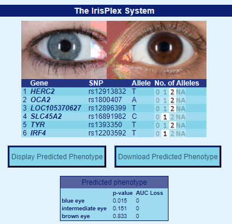
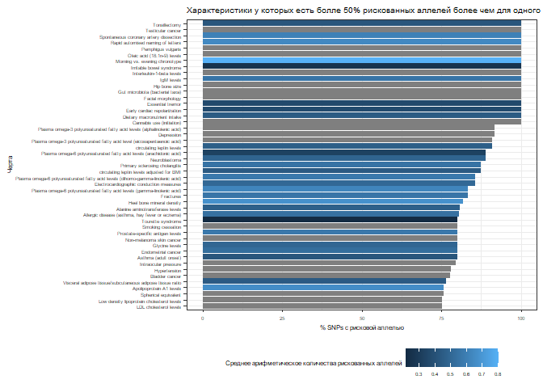

### Цели : 

Рассмотреть [базу по генотипированию](https://opensnp.org/data/10095.23andme.8356?1612170074) пользователя [tundra9910](https://opensnp.org/users/10095) и выполнить следующие задания для нее:

##### Задание 1:
  1. Определить цвет глаз, используя [IrisPlex](https://hirisplex.erasmusmc.nl/)
  2. Определить степень риска тромбоза
  3. Рассмотреть несколько (хотя бы 3) признаков и проверить 
  
### Обработка:

Загрузим используемые библиотеки


```r
knitr::opts_chunk$set(echo = TRUE)
```


```r
Sys.setlocale(category = "LC_ALL", locale = "Russian")
```

```
## [1] "LC_COLLATE=Russian_Russia.1251;LC_CTYPE=Russian_Russia.1251;LC_MONETARY=Russian_Russia.1251;LC_NUMERIC=C;LC_TIME=Russian_Russia.1251"
```

```r
library(readr)
library(ggplot2)
library(dplyr)
library(gwascat)
library(stringr)
library(kableExtra)
library(tidystringdist)
library(tidyverse)
```

Скачаем базу 23 and Me с [Opensnp](https://opensnp.org/users/10095) и прочтем ее


```r
genome_raw <- read_tsv("10095.23andme.8356", skip = 19, col_types = cols(
 `# rsid` = col_character(),
 chromosome = col_character(),
 position = col_integer(),
 genotype = col_character())
 )

genome_raw <- rename(genome_raw, rsid = `# rsid`)
```

Рассмотрим полученные данные


```r
head(genome_raw)
```

```
## # A tibble: 6 x 4
##   rsid        chromosome position genotype
##   <chr>       <chr>         <int> <chr>   
## 1 rs548049170 1             69869 TT      
## 2 rs9283150   1            565508 AA      
## 3 rs116587930 1            727841 GG      
## 4 rs3131972   1            752721 AG      
## 5 rs12184325  1            754105 CC      
## 6 rs12567639  1            756268 AA
```
<br/>
**rsid** -- уникальный номер, используемый для идентификация различных SNP (Single Nucleotide Polymorphism). Сама аббревиатура происходит от Reference SNP cluster ID 
<br/><br/>

##### Пункт 1
Чтобы узнать цвет глаз, необходимо найти значения при **rs12913832, rs1800407, rs12896399, rs16891982, rs1393350, rs12203592** и внести их в таблицу [IrisPlex](https://hirisplex.erasmusmc.nl/), это можно сделать как вручную, сделав поиск по базе, так и используя *grepl* и *filter*

```r
dplyr::filter(genome_raw, grepl('\\brs12913832\\b|\\brs1800407\\b|\\brs12896399\\b|\\brs16891982\\b|\\brs1393350\\b|\\brs12203592\\b', rsid))
```

```
## # A tibble: 6 x 4
##   rsid       chromosome position genotype
##   <chr>      <chr>         <int> <chr>   
## 1 rs16891982 5          33951693 CG      
## 2 rs12203592 6            396321 CT      
## 3 rs1393350  11         89011046 GG      
## 4 rs12896399 14         92773663 GG      
## 5 rs1800407  15         28230318 CC      
## 6 rs12913832 15         28365618 GG
```

Теперь мы можем подставить значения и узнать цвет глаз, внеся количество соответствующих аллелей в систему, мы получим:
<br/>

<br/>
То есть у рассматриваемого человека вероятнее всего карие глаза
<br/><br/><br/>

##### Пункт 2
Далее узнаем вероятность тромбоза, рассмотрев **rs6025** (F5, factor V Leiden), **rs1799963** (F2, 20210 G > A), **rs8176719** (ABO), **rs2066865** (FGG, 10034 C > T), **rs2036914** (F11) 

```r
dplyr::filter(genome_raw, grepl('\\brs6025\\b|\\brs1799963\\b|\\brs8176719\\b|\\brs2066865\\b|\\brs2036914\\b', rsid))
```

```
## # A tibble: 4 x 4
##   rsid      chromosome  position genotype
##   <chr>     <chr>          <int> <chr>   
## 1 rs6025    1          169519049 CC      
## 2 rs2066865 4          155525276 GG      
## 3 rs2036914 4          187192481 CC      
## 4 rs8176719 9          136132909 DI
```
Исходя из статьи [Multiple SNP testing improves risk prediction of first venous thrombosis](https://ashpublications.org/blood/article/120/3/656/30474/Multiple-SNP-testing-improves-risk-prediction-of) можно выяснить, что рискованными являются **rs6025 - AA, rs1799963 - AA, rs8176719 - GG, rs2066865 - TT, rs2036914 - CC** и у рассматриваемого человека генотип **rs2036924** рискованный.
<br/><br/><br/> 


##### Пункт 3
вернемся к датабазе
23 and Me имеет SNP, которых может не быть в GWAS базе, которую мы используем (gwascat -- пакет R, служащий интерфейсом к базе даных [NHGRI](https://www.genome.gov/), в которую занесены различные работы, изучающие связи генов с заболеваниями и другими характеристиками).
<br/> 
Скачаем базу NHGRI

```r
updated_gwas_data <- as.data.frame(makeCurrentGwascat())
```

Объединим ее с имеющейся базой, зная, что **rsid** и **SNP** это одно и то же

```r
join_data <- inner_join(genome_raw, 
                        updated_gwas_data, 
                        by = c("rsid" = "SNPS"))
```

Разделим генотип на группы (separate fields) 

```r
join_data$risk_allele_clean <- str_sub(join_data$STRONGEST.SNP.RISK.ALLELE, -1)
join_data$my_allele_1 <- str_sub(join_data$genotype, 1, 1)
join_data$my_allele_2 <- str_sub(join_data$genotype, 2, 2)
join_data$have_risk_allele_count <- if_else(
  join_data$my_allele_1 == join_data$risk_allele_clean, 1, 0) + 
  if_else(
    join_data$my_allele_2 == join_data$risk_allele_clean, 1, 0)
```

Избавимся от аллелей, с которыми ничего не связано

```r
risk_data<- select(join_data,
       have_risk_allele_count,
       rsid,
       my_genotype = genotype,
       risk_allele = risk_allele_clean,
       DISEASE.TRAIT,
       MAPPED_TRAIT,
       RISK.ALLELE.FREQUENCY,
       REPORTED.GENE.S.) %>%
filter(have_risk_allele_count>0)
```

Рассмотрим 

```r
#Количество признаков заболеваний или других характеристик
trait_count_mapped <- risk_data %>%
  group_by(MAPPED_TRAIT) %>%
  summarise(risk_count = n()) 

#Количество признаков заболеваний или других характеристик для рискованной аллели = 2
trait_count_mapped2 <- risk_data %>%
  group_by(MAPPED_TRAIT, have_risk_allele_count) %>%
  filter(have_risk_allele_count==2) %>%
  summarise(risk_count_2 = n()) %>%
 subset(select = -c(have_risk_allele_count))

#Объединим risk counts для аллелей =1 и аллелей = 2
trait_count_mapped3<- 
  merge(trait_count_mapped, trait_count_mapped2, 
        by = c("MAPPED_TRAIT", "MAPPED_TRAIT"),all=TRUE) 

trait_count_mapped3[is.na(trait_count_mapped3)] <- 0

#Risk count для уравнения Allele_1
risk_1 <- (trait_count_mapped3$risk_count - trait_count_mapped3$risk_count_2)

#Добавим risk_1 
trait_count_mapped4 <- select(trait_count_mapped3,
  MAPPED_TRAIT,
  risk_count,
  risk_count_2
)%>%
  mutate(risk_1
         )
#Добавим Overall Risk
overall_risk <- (trait_count_mapped3$risk_count_2 / ((trait_count_mapped3$risk_count_2 + trait_count_mapped4$risk_1*2)))+(trait_count_mapped4$risk_1/((trait_count_mapped3$risk_count_2+trait_count_mapped4$risk_1*2)))

overall_risk_count <- select(trait_count_mapped4,
       MAPPED_TRAIT,
       risk_count,
       risk_1,
       risk_count_2,
       ) %>%
  mutate(overall_risk*100) 

overall_risk_count[is.na(overall_risk_count)] <- 0


#Получим число признаков заболеваний или других характеристик через DISEASE.TRAIT
trait_count_disease <- risk_data %>%
  group_by(DISEASE.TRAIT)%>%
  summarise(risk_count= n())

#Посчитаем число признаков заболеваний или других характеристик для Risk Allele = 2
trait_count_disease2 <- risk_data %>%
  group_by(DISEASE.TRAIT, have_risk_allele_count) %>%
  filter(have_risk_allele_count==2) %>%
  summarise(risk_count_2 = n()) %>%
 subset(select = -c(have_risk_allele_count))

#Объединим Risk Counts для однинарной и парной рискованной аллели
trait_count_disease3<- 
  merge(trait_count_disease, trait_count_disease2, 
        by = c("DISEASE.TRAIT", "DISEASE.TRAIT"),all=TRUE) 

trait_count_disease3[is.na(trait_count_disease3)] <- 0

#Посчитаем риск для одинарных рискованных аллелей
risk_d_1 <- (trait_count_disease3$risk_count - trait_count_disease3$risk_count_2)

#Добавим risk_1
trait_count_disease4 <- select(trait_count_disease3,
  DISEASE.TRAIT,
  risk_count,
  risk_count_2
)%>%
  mutate(risk_d_1
         )
#Посчитаем общий риск
overall_risk_d <- (trait_count_disease3$risk_count_2 / ((trait_count_disease3$risk_count_2 + trait_count_disease4$risk_d_1*2)))+(trait_count_disease4$risk_d_1/((trait_count_disease3$risk_count_2+trait_count_disease4$risk_d_1*2)))

overall_risk_count_d <- select(trait_count_disease4,
       DISEASE.TRAIT,
       risk_count,
       risk_1= "risk_d_1",
       risk_count_2,
       ) %>%
  mutate(overall_risk_d*100) 

overall_risk_count[is.na(overall_risk_count)] <- 0
```
<br/> 
При замене **DISEASE.TRAIT** на **MAPPED_TRAIT** мы можем избавиться от избыточных записей.
<br/>
<br/>
Далее мы будем использовать обозначения:<br/>
**overall_risk** -- общая вероятность наличия какой-либо особенности. Мы ее будем вычислять как вероятность наличия одинарной аллели, умноженной на 2, сравненой с количество одинарных аллелей, которые могут быть у носителя. То есть сумма одинарных аллелей умноженная на два и сложенная с количеством двойных аллелей, умноженных на два(так как мутации могут находится на двух парных хромосомах)
<br/>
<br/> 
$\text{overall_risk} = \frac{\text{risk_count_1}}{2 \cdot \text{risk_count_1} + \text{risk_count_2}} + \frac{\text{risk_count_2}}{2 \cdot \text{risk_count_1} + \text{risk_count_2}}$
<br/> 
<br/>
**risk_1** -- общее количество одинарных аллелей, связанных с какой-либо особенностью<br/>
**risk_count_2** -- общее количество двойных аллелей, связанных с какой-либо особенностью<br/>
**risk_count** -- общее количество аллелей, связанных с какой-либо особенностью<br/>
<br/>


```r
#Таблица признаков заболеваний с более чем 100 аллелями для MAPPED_TRAIT
table1 <-overall_risk_count %>%
  filter(risk_count > 99) %>%
  arrange(risk_count) %>%
  kable () %>%
  kable_paper("hover", full_width=F)
table1
```

<table class=" lightable-paper lightable-hover" style='font-family: "Arial Narrow", arial, helvetica, sans-serif; width: auto !important; margin-left: auto; margin-right: auto;'>
 <thead>
  <tr>
   <th style="text-align:left;"> MAPPED_TRAIT </th>
   <th style="text-align:right;"> risk_count </th>
   <th style="text-align:right;"> risk_1 </th>
   <th style="text-align:right;"> risk_count_2 </th>
   <th style="text-align:right;"> overall_risk * 100 </th>
  </tr>
 </thead>
<tbody>
  <tr>
   <td style="text-align:left;"> smoking behavior, BMI-adjusted waist circumference </td>
   <td style="text-align:right;"> 101 </td>
   <td style="text-align:right;"> 57 </td>
   <td style="text-align:right;"> 44 </td>
   <td style="text-align:right;"> 63.92405 </td>
  </tr>
  <tr>
   <td style="text-align:left;"> age at menarche </td>
   <td style="text-align:right;"> 102 </td>
   <td style="text-align:right;"> 54 </td>
   <td style="text-align:right;"> 48 </td>
   <td style="text-align:right;"> 65.38462 </td>
  </tr>
  <tr>
   <td style="text-align:left;"> intelligence </td>
   <td style="text-align:right;"> 103 </td>
   <td style="text-align:right;"> 65 </td>
   <td style="text-align:right;"> 38 </td>
   <td style="text-align:right;"> 61.30952 </td>
  </tr>
  <tr>
   <td style="text-align:left;"> BMI-adjusted waist circumference </td>
   <td style="text-align:right;"> 106 </td>
   <td style="text-align:right;"> 61 </td>
   <td style="text-align:right;"> 45 </td>
   <td style="text-align:right;"> 63.47305 </td>
  </tr>
  <tr>
   <td style="text-align:left;"> testosterone measurement </td>
   <td style="text-align:right;"> 107 </td>
   <td style="text-align:right;"> 39 </td>
   <td style="text-align:right;"> 68 </td>
   <td style="text-align:right;"> 73.28767 </td>
  </tr>
  <tr>
   <td style="text-align:left;"> hematocrit </td>
   <td style="text-align:right;"> 111 </td>
   <td style="text-align:right;"> 78 </td>
   <td style="text-align:right;"> 33 </td>
   <td style="text-align:right;"> 58.73016 </td>
  </tr>
  <tr>
   <td style="text-align:left;"> glomerular filtration rate </td>
   <td style="text-align:right;"> 112 </td>
   <td style="text-align:right;"> 62 </td>
   <td style="text-align:right;"> 50 </td>
   <td style="text-align:right;"> 64.36782 </td>
  </tr>
  <tr>
   <td style="text-align:left;"> lymphocyte count </td>
   <td style="text-align:right;"> 116 </td>
   <td style="text-align:right;"> 76 </td>
   <td style="text-align:right;"> 40 </td>
   <td style="text-align:right;"> 60.41667 </td>
  </tr>
  <tr>
   <td style="text-align:left;"> reticulocyte count </td>
   <td style="text-align:right;"> 117 </td>
   <td style="text-align:right;"> 67 </td>
   <td style="text-align:right;"> 50 </td>
   <td style="text-align:right;"> 63.58696 </td>
  </tr>
  <tr>
   <td style="text-align:left;"> pulse pressure measurement </td>
   <td style="text-align:right;"> 118 </td>
   <td style="text-align:right;"> 53 </td>
   <td style="text-align:right;"> 65 </td>
   <td style="text-align:right;"> 69.00585 </td>
  </tr>
  <tr>
   <td style="text-align:left;"> asthma </td>
   <td style="text-align:right;"> 123 </td>
   <td style="text-align:right;"> 59 </td>
   <td style="text-align:right;"> 64 </td>
   <td style="text-align:right;"> 67.58242 </td>
  </tr>
  <tr>
   <td style="text-align:left;"> monocyte count </td>
   <td style="text-align:right;"> 127 </td>
   <td style="text-align:right;"> 80 </td>
   <td style="text-align:right;"> 47 </td>
   <td style="text-align:right;"> 61.35266 </td>
  </tr>
  <tr>
   <td style="text-align:left;"> mathematical ability </td>
   <td style="text-align:right;"> 129 </td>
   <td style="text-align:right;"> 72 </td>
   <td style="text-align:right;"> 57 </td>
   <td style="text-align:right;"> 64.17910 </td>
  </tr>
  <tr>
   <td style="text-align:left;"> colorectal cancer </td>
   <td style="text-align:right;"> 130 </td>
   <td style="text-align:right;"> 85 </td>
   <td style="text-align:right;"> 45 </td>
   <td style="text-align:right;"> 60.46512 </td>
  </tr>
  <tr>
   <td style="text-align:left;"> C-reactive protein measurement </td>
   <td style="text-align:right;"> 134 </td>
   <td style="text-align:right;"> 51 </td>
   <td style="text-align:right;"> 83 </td>
   <td style="text-align:right;"> 72.43243 </td>
  </tr>
  <tr>
   <td style="text-align:left;"> Crohn's disease </td>
   <td style="text-align:right;"> 134 </td>
   <td style="text-align:right;"> 77 </td>
   <td style="text-align:right;"> 57 </td>
   <td style="text-align:right;"> 63.50711 </td>
  </tr>
  <tr>
   <td style="text-align:left;"> hemoglobin measurement </td>
   <td style="text-align:right;"> 145 </td>
   <td style="text-align:right;"> 99 </td>
   <td style="text-align:right;"> 46 </td>
   <td style="text-align:right;"> 59.42623 </td>
  </tr>
  <tr>
   <td style="text-align:left;"> self reported educational attainment </td>
   <td style="text-align:right;"> 145 </td>
   <td style="text-align:right;"> 77 </td>
   <td style="text-align:right;"> 68 </td>
   <td style="text-align:right;"> 65.31532 </td>
  </tr>
  <tr>
   <td style="text-align:left;"> urate measurement </td>
   <td style="text-align:right;"> 146 </td>
   <td style="text-align:right;"> 75 </td>
   <td style="text-align:right;"> 71 </td>
   <td style="text-align:right;"> 66.06335 </td>
  </tr>
  <tr>
   <td style="text-align:left;"> bone density </td>
   <td style="text-align:right;"> 149 </td>
   <td style="text-align:right;"> 92 </td>
   <td style="text-align:right;"> 57 </td>
   <td style="text-align:right;"> 61.82573 </td>
  </tr>
  <tr>
   <td style="text-align:left;"> heel bone mineral density </td>
   <td style="text-align:right;"> 162 </td>
   <td style="text-align:right;"> 74 </td>
   <td style="text-align:right;"> 88 </td>
   <td style="text-align:right;"> 68.64407 </td>
  </tr>
  <tr>
   <td style="text-align:left;"> mean platelet volume </td>
   <td style="text-align:right;"> 166 </td>
   <td style="text-align:right;"> 69 </td>
   <td style="text-align:right;"> 97 </td>
   <td style="text-align:right;"> 70.63830 </td>
  </tr>
  <tr>
   <td style="text-align:left;"> physical activity measurement, body mass index </td>
   <td style="text-align:right;"> 177 </td>
   <td style="text-align:right;"> 124 </td>
   <td style="text-align:right;"> 53 </td>
   <td style="text-align:right;"> 58.80399 </td>
  </tr>
  <tr>
   <td style="text-align:left;"> blood metabolite measurement </td>
   <td style="text-align:right;"> 184 </td>
   <td style="text-align:right;"> 104 </td>
   <td style="text-align:right;"> 80 </td>
   <td style="text-align:right;"> 63.88889 </td>
  </tr>
  <tr>
   <td style="text-align:left;"> waist-hip ratio </td>
   <td style="text-align:right;"> 187 </td>
   <td style="text-align:right;"> 103 </td>
   <td style="text-align:right;"> 84 </td>
   <td style="text-align:right;"> 64.48276 </td>
  </tr>
  <tr>
   <td style="text-align:left;"> diastolic blood pressure </td>
   <td style="text-align:right;"> 191 </td>
   <td style="text-align:right;"> 111 </td>
   <td style="text-align:right;"> 80 </td>
   <td style="text-align:right;"> 63.24503 </td>
  </tr>
  <tr>
   <td style="text-align:left;"> coronary artery disease </td>
   <td style="text-align:right;"> 193 </td>
   <td style="text-align:right;"> 110 </td>
   <td style="text-align:right;"> 83 </td>
   <td style="text-align:right;"> 63.69637 </td>
  </tr>
  <tr>
   <td style="text-align:left;"> mean corpuscular volume </td>
   <td style="text-align:right;"> 194 </td>
   <td style="text-align:right;"> 124 </td>
   <td style="text-align:right;"> 70 </td>
   <td style="text-align:right;"> 61.00629 </td>
  </tr>
  <tr>
   <td style="text-align:left;"> platelet count </td>
   <td style="text-align:right;"> 198 </td>
   <td style="text-align:right;"> 111 </td>
   <td style="text-align:right;"> 87 </td>
   <td style="text-align:right;"> 64.07767 </td>
  </tr>
  <tr>
   <td style="text-align:left;"> BMI-adjusted waist circumference, physical activity measurement </td>
   <td style="text-align:right;"> 199 </td>
   <td style="text-align:right;"> 103 </td>
   <td style="text-align:right;"> 96 </td>
   <td style="text-align:right;"> 65.89404 </td>
  </tr>
  <tr>
   <td style="text-align:left;"> serum IgG glycosylation measurement </td>
   <td style="text-align:right;"> 208 </td>
   <td style="text-align:right;"> 73 </td>
   <td style="text-align:right;"> 135 </td>
   <td style="text-align:right;"> 74.02135 </td>
  </tr>
  <tr>
   <td style="text-align:left;"> systolic blood pressure </td>
   <td style="text-align:right;"> 209 </td>
   <td style="text-align:right;"> 119 </td>
   <td style="text-align:right;"> 90 </td>
   <td style="text-align:right;"> 63.71951 </td>
  </tr>
  <tr>
   <td style="text-align:left;"> rheumatoid arthritis </td>
   <td style="text-align:right;"> 216 </td>
   <td style="text-align:right;"> 131 </td>
   <td style="text-align:right;"> 85 </td>
   <td style="text-align:right;"> 62.24784 </td>
  </tr>
  <tr>
   <td style="text-align:left;"> sex hormone-binding globulin measurement </td>
   <td style="text-align:right;"> 217 </td>
   <td style="text-align:right;"> 94 </td>
   <td style="text-align:right;"> 123 </td>
   <td style="text-align:right;"> 69.77492 </td>
  </tr>
  <tr>
   <td style="text-align:left;"> smoking behavior, body mass index </td>
   <td style="text-align:right;"> 219 </td>
   <td style="text-align:right;"> 119 </td>
   <td style="text-align:right;"> 100 </td>
   <td style="text-align:right;"> 64.79290 </td>
  </tr>
  <tr>
   <td style="text-align:left;"> prostate carcinoma </td>
   <td style="text-align:right;"> 222 </td>
   <td style="text-align:right;"> 101 </td>
   <td style="text-align:right;"> 121 </td>
   <td style="text-align:right;"> 68.73065 </td>
  </tr>
  <tr>
   <td style="text-align:left;"> schizophrenia </td>
   <td style="text-align:right;"> 271 </td>
   <td style="text-align:right;"> 143 </td>
   <td style="text-align:right;"> 128 </td>
   <td style="text-align:right;"> 65.45894 </td>
  </tr>
  <tr>
   <td style="text-align:left;"> breast carcinoma </td>
   <td style="text-align:right;"> 290 </td>
   <td style="text-align:right;"> 140 </td>
   <td style="text-align:right;"> 150 </td>
   <td style="text-align:right;"> 67.44186 </td>
  </tr>
  <tr>
   <td style="text-align:left;"> blood protein measurement </td>
   <td style="text-align:right;"> 360 </td>
   <td style="text-align:right;"> 199 </td>
   <td style="text-align:right;"> 161 </td>
   <td style="text-align:right;"> 64.40072 </td>
  </tr>
  <tr>
   <td style="text-align:left;"> BMI-adjusted waist-hip ratio </td>
   <td style="text-align:right;"> 379 </td>
   <td style="text-align:right;"> 187 </td>
   <td style="text-align:right;"> 192 </td>
   <td style="text-align:right;"> 66.96113 </td>
  </tr>
  <tr>
   <td style="text-align:left;"> total cholesterol measurement </td>
   <td style="text-align:right;"> 466 </td>
   <td style="text-align:right;"> 256 </td>
   <td style="text-align:right;"> 210 </td>
   <td style="text-align:right;"> 64.54294 </td>
  </tr>
  <tr>
   <td style="text-align:left;"> body height </td>
   <td style="text-align:right;"> 512 </td>
   <td style="text-align:right;"> 293 </td>
   <td style="text-align:right;"> 219 </td>
   <td style="text-align:right;"> 63.60248 </td>
  </tr>
  <tr>
   <td style="text-align:left;"> low density lipoprotein cholesterol measurement </td>
   <td style="text-align:right;"> 514 </td>
   <td style="text-align:right;"> 265 </td>
   <td style="text-align:right;"> 249 </td>
   <td style="text-align:right;"> 65.98203 </td>
  </tr>
  <tr>
   <td style="text-align:left;"> triglyceride measurement </td>
   <td style="text-align:right;"> 531 </td>
   <td style="text-align:right;"> 245 </td>
   <td style="text-align:right;"> 286 </td>
   <td style="text-align:right;"> 68.42784 </td>
  </tr>
  <tr>
   <td style="text-align:left;"> type II diabetes mellitus </td>
   <td style="text-align:right;"> 592 </td>
   <td style="text-align:right;"> 286 </td>
   <td style="text-align:right;"> 306 </td>
   <td style="text-align:right;"> 67.42597 </td>
  </tr>
  <tr>
   <td style="text-align:left;"> high density lipoprotein cholesterol measurement </td>
   <td style="text-align:right;"> 635 </td>
   <td style="text-align:right;"> 330 </td>
   <td style="text-align:right;"> 305 </td>
   <td style="text-align:right;"> 65.80311 </td>
  </tr>
  <tr>
   <td style="text-align:left;"> electrocardiography </td>
   <td style="text-align:right;"> 727 </td>
   <td style="text-align:right;"> 299 </td>
   <td style="text-align:right;"> 428 </td>
   <td style="text-align:right;"> 70.85770 </td>
  </tr>
  <tr>
   <td style="text-align:left;"> body mass index </td>
   <td style="text-align:right;"> 923 </td>
   <td style="text-align:right;"> 536 </td>
   <td style="text-align:right;"> 387 </td>
   <td style="text-align:right;"> 63.26251 </td>
  </tr>
</tbody>
</table>


```r
#Таблица заболеваний и характеристик с более чем 100 рискованными аллелями для DISEASE.TRAIT
table2 <-overall_risk_count_d %>%
  filter(risk_count > 99) %>%
  arrange(risk_count) %>%
  kable () %>%
  kable_paper("hover", full_width=F)
table2
```

<table class=" lightable-paper lightable-hover" style='font-family: "Arial Narrow", arial, helvetica, sans-serif; width: auto !important; margin-left: auto; margin-right: auto;'>
 <thead>
  <tr>
   <th style="text-align:left;"> DISEASE.TRAIT </th>
   <th style="text-align:right;"> risk_count </th>
   <th style="text-align:right;"> risk_1 </th>
   <th style="text-align:right;"> risk_count_2 </th>
   <th style="text-align:right;"> overall_risk_d * 100 </th>
  </tr>
 </thead>
<tbody>
  <tr>
   <td style="text-align:left;"> BMI (adjusted for smoking behaviour) </td>
   <td style="text-align:right;"> 100 </td>
   <td style="text-align:right;"> 54 </td>
   <td style="text-align:right;"> 46 </td>
   <td style="text-align:right;"> 64.93506 </td>
  </tr>
  <tr>
   <td style="text-align:left;"> Menarche (age at onset) </td>
   <td style="text-align:right;"> 101 </td>
   <td style="text-align:right;"> 53 </td>
   <td style="text-align:right;"> 48 </td>
   <td style="text-align:right;"> 65.58442 </td>
  </tr>
  <tr>
   <td style="text-align:left;"> Sex hormone-binding globulin levels adjusted for BMI </td>
   <td style="text-align:right;"> 102 </td>
   <td style="text-align:right;"> 43 </td>
   <td style="text-align:right;"> 59 </td>
   <td style="text-align:right;"> 70.34483 </td>
  </tr>
  <tr>
   <td style="text-align:left;"> Hematocrit </td>
   <td style="text-align:right;"> 107 </td>
   <td style="text-align:right;"> 76 </td>
   <td style="text-align:right;"> 31 </td>
   <td style="text-align:right;"> 58.46995 </td>
  </tr>
  <tr>
   <td style="text-align:left;"> Waist-to-hip ratio adjusted for BMI </td>
   <td style="text-align:right;"> 108 </td>
   <td style="text-align:right;"> 56 </td>
   <td style="text-align:right;"> 52 </td>
   <td style="text-align:right;"> 65.85366 </td>
  </tr>
  <tr>
   <td style="text-align:left;"> Pulse pressure </td>
   <td style="text-align:right;"> 112 </td>
   <td style="text-align:right;"> 50 </td>
   <td style="text-align:right;"> 62 </td>
   <td style="text-align:right;"> 69.13580 </td>
  </tr>
  <tr>
   <td style="text-align:left;"> Asthma </td>
   <td style="text-align:right;"> 113 </td>
   <td style="text-align:right;"> 54 </td>
   <td style="text-align:right;"> 59 </td>
   <td style="text-align:right;"> 67.66467 </td>
  </tr>
  <tr>
   <td style="text-align:left;"> Lymphocyte counts </td>
   <td style="text-align:right;"> 114 </td>
   <td style="text-align:right;"> 75 </td>
   <td style="text-align:right;"> 39 </td>
   <td style="text-align:right;"> 60.31746 </td>
  </tr>
  <tr>
   <td style="text-align:left;"> C-reactive protein levels </td>
   <td style="text-align:right;"> 115 </td>
   <td style="text-align:right;"> 41 </td>
   <td style="text-align:right;"> 74 </td>
   <td style="text-align:right;"> 73.71795 </td>
  </tr>
  <tr>
   <td style="text-align:left;"> Sex hormone-binding globulin levels </td>
   <td style="text-align:right;"> 115 </td>
   <td style="text-align:right;"> 51 </td>
   <td style="text-align:right;"> 64 </td>
   <td style="text-align:right;"> 69.27711 </td>
  </tr>
  <tr>
   <td style="text-align:left;"> Mean corpuscular hemoglobin </td>
   <td style="text-align:right;"> 116 </td>
   <td style="text-align:right;"> 67 </td>
   <td style="text-align:right;"> 49 </td>
   <td style="text-align:right;"> 63.38798 </td>
  </tr>
  <tr>
   <td style="text-align:left;"> Monocyte count </td>
   <td style="text-align:right;"> 117 </td>
   <td style="text-align:right;"> 75 </td>
   <td style="text-align:right;"> 42 </td>
   <td style="text-align:right;"> 60.93750 </td>
  </tr>
  <tr>
   <td style="text-align:left;"> HDL cholesterol </td>
   <td style="text-align:right;"> 125 </td>
   <td style="text-align:right;"> 86 </td>
   <td style="text-align:right;"> 39 </td>
   <td style="text-align:right;"> 59.24171 </td>
  </tr>
  <tr>
   <td style="text-align:left;"> Red blood cell count </td>
   <td style="text-align:right;"> 126 </td>
   <td style="text-align:right;"> 79 </td>
   <td style="text-align:right;"> 47 </td>
   <td style="text-align:right;"> 61.46341 </td>
  </tr>
  <tr>
   <td style="text-align:left;"> Colorectal cancer </td>
   <td style="text-align:right;"> 130 </td>
   <td style="text-align:right;"> 85 </td>
   <td style="text-align:right;"> 45 </td>
   <td style="text-align:right;"> 60.46512 </td>
  </tr>
  <tr>
   <td style="text-align:left;"> Coronary artery disease </td>
   <td style="text-align:right;"> 130 </td>
   <td style="text-align:right;"> 74 </td>
   <td style="text-align:right;"> 56 </td>
   <td style="text-align:right;"> 63.72549 </td>
  </tr>
  <tr>
   <td style="text-align:left;"> Crohn's disease </td>
   <td style="text-align:right;"> 134 </td>
   <td style="text-align:right;"> 77 </td>
   <td style="text-align:right;"> 57 </td>
   <td style="text-align:right;"> 63.50711 </td>
  </tr>
  <tr>
   <td style="text-align:left;"> Mean corpuscular volume </td>
   <td style="text-align:right;"> 136 </td>
   <td style="text-align:right;"> 81 </td>
   <td style="text-align:right;"> 55 </td>
   <td style="text-align:right;"> 62.67281 </td>
  </tr>
  <tr>
   <td style="text-align:left;"> LDL cholesterol levels </td>
   <td style="text-align:right;"> 137 </td>
   <td style="text-align:right;"> 83 </td>
   <td style="text-align:right;"> 54 </td>
   <td style="text-align:right;"> 62.27273 </td>
  </tr>
  <tr>
   <td style="text-align:left;"> White blood cell count </td>
   <td style="text-align:right;"> 140 </td>
   <td style="text-align:right;"> 82 </td>
   <td style="text-align:right;"> 58 </td>
   <td style="text-align:right;"> 63.06306 </td>
  </tr>
  <tr>
   <td style="text-align:left;"> Triglyceride levels </td>
   <td style="text-align:right;"> 146 </td>
   <td style="text-align:right;"> 66 </td>
   <td style="text-align:right;"> 80 </td>
   <td style="text-align:right;"> 68.86792 </td>
  </tr>
  <tr>
   <td style="text-align:left;"> Urate levels </td>
   <td style="text-align:right;"> 147 </td>
   <td style="text-align:right;"> 76 </td>
   <td style="text-align:right;"> 71 </td>
   <td style="text-align:right;"> 65.91928 </td>
  </tr>
  <tr>
   <td style="text-align:left;"> Blood metabolite levels </td>
   <td style="text-align:right;"> 152 </td>
   <td style="text-align:right;"> 83 </td>
   <td style="text-align:right;"> 69 </td>
   <td style="text-align:right;"> 64.68085 </td>
  </tr>
  <tr>
   <td style="text-align:left;"> HDL cholesterol levels </td>
   <td style="text-align:right;"> 161 </td>
   <td style="text-align:right;"> 83 </td>
   <td style="text-align:right;"> 78 </td>
   <td style="text-align:right;"> 65.98361 </td>
  </tr>
  <tr>
   <td style="text-align:left;"> Heel bone mineral density </td>
   <td style="text-align:right;"> 161 </td>
   <td style="text-align:right;"> 73 </td>
   <td style="text-align:right;"> 88 </td>
   <td style="text-align:right;"> 68.80342 </td>
  </tr>
  <tr>
   <td style="text-align:left;"> Mean platelet volume </td>
   <td style="text-align:right;"> 166 </td>
   <td style="text-align:right;"> 69 </td>
   <td style="text-align:right;"> 97 </td>
   <td style="text-align:right;"> 70.63830 </td>
  </tr>
  <tr>
   <td style="text-align:left;"> Waist circumference adjusted for body mass index </td>
   <td style="text-align:right;"> 171 </td>
   <td style="text-align:right;"> 90 </td>
   <td style="text-align:right;"> 81 </td>
   <td style="text-align:right;"> 65.51724 </td>
  </tr>
  <tr>
   <td style="text-align:left;"> Diastolic blood pressure </td>
   <td style="text-align:right;"> 181 </td>
   <td style="text-align:right;"> 105 </td>
   <td style="text-align:right;"> 76 </td>
   <td style="text-align:right;"> 63.28671 </td>
  </tr>
  <tr>
   <td style="text-align:left;"> Waist-hip ratio </td>
   <td style="text-align:right;"> 187 </td>
   <td style="text-align:right;"> 103 </td>
   <td style="text-align:right;"> 84 </td>
   <td style="text-align:right;"> 64.48276 </td>
  </tr>
  <tr>
   <td style="text-align:left;"> Platelet count </td>
   <td style="text-align:right;"> 196 </td>
   <td style="text-align:right;"> 110 </td>
   <td style="text-align:right;"> 86 </td>
   <td style="text-align:right;"> 64.05229 </td>
  </tr>
  <tr>
   <td style="text-align:left;"> Systolic blood pressure </td>
   <td style="text-align:right;"> 198 </td>
   <td style="text-align:right;"> 112 </td>
   <td style="text-align:right;"> 86 </td>
   <td style="text-align:right;"> 63.87097 </td>
  </tr>
  <tr>
   <td style="text-align:left;"> Rheumatoid arthritis </td>
   <td style="text-align:right;"> 201 </td>
   <td style="text-align:right;"> 121 </td>
   <td style="text-align:right;"> 80 </td>
   <td style="text-align:right;"> 62.42236 </td>
  </tr>
  <tr>
   <td style="text-align:left;"> Waist-to-hip ratio adjusted for body mass index </td>
   <td style="text-align:right;"> 201 </td>
   <td style="text-align:right;"> 98 </td>
   <td style="text-align:right;"> 103 </td>
   <td style="text-align:right;"> 67.22408 </td>
  </tr>
  <tr>
   <td style="text-align:left;"> IgG glycosylation </td>
   <td style="text-align:right;"> 202 </td>
   <td style="text-align:right;"> 71 </td>
   <td style="text-align:right;"> 131 </td>
   <td style="text-align:right;"> 73.99267 </td>
  </tr>
  <tr>
   <td style="text-align:left;"> Prostate cancer </td>
   <td style="text-align:right;"> 214 </td>
   <td style="text-align:right;"> 96 </td>
   <td style="text-align:right;"> 118 </td>
   <td style="text-align:right;"> 69.03226 </td>
  </tr>
  <tr>
   <td style="text-align:left;"> Schizophrenia </td>
   <td style="text-align:right;"> 271 </td>
   <td style="text-align:right;"> 143 </td>
   <td style="text-align:right;"> 128 </td>
   <td style="text-align:right;"> 65.45894 </td>
  </tr>
  <tr>
   <td style="text-align:left;"> Low density lipoprotein cholesterol levels </td>
   <td style="text-align:right;"> 277 </td>
   <td style="text-align:right;"> 118 </td>
   <td style="text-align:right;"> 159 </td>
   <td style="text-align:right;"> 70.12658 </td>
  </tr>
  <tr>
   <td style="text-align:left;"> Breast cancer </td>
   <td style="text-align:right;"> 284 </td>
   <td style="text-align:right;"> 138 </td>
   <td style="text-align:right;"> 146 </td>
   <td style="text-align:right;"> 67.29858 </td>
  </tr>
  <tr>
   <td style="text-align:left;"> High density lipoprotein cholesterol levels </td>
   <td style="text-align:right;"> 341 </td>
   <td style="text-align:right;"> 155 </td>
   <td style="text-align:right;"> 186 </td>
   <td style="text-align:right;"> 68.75000 </td>
  </tr>
  <tr>
   <td style="text-align:left;"> Triglycerides </td>
   <td style="text-align:right;"> 363 </td>
   <td style="text-align:right;"> 176 </td>
   <td style="text-align:right;"> 187 </td>
   <td style="text-align:right;"> 67.34694 </td>
  </tr>
  <tr>
   <td style="text-align:left;"> Total cholesterol levels </td>
   <td style="text-align:right;"> 381 </td>
   <td style="text-align:right;"> 191 </td>
   <td style="text-align:right;"> 190 </td>
   <td style="text-align:right;"> 66.60839 </td>
  </tr>
  <tr>
   <td style="text-align:left;"> Blood protein levels </td>
   <td style="text-align:right;"> 426 </td>
   <td style="text-align:right;"> 252 </td>
   <td style="text-align:right;"> 174 </td>
   <td style="text-align:right;"> 62.83186 </td>
  </tr>
  <tr>
   <td style="text-align:left;"> Height </td>
   <td style="text-align:right;"> 464 </td>
   <td style="text-align:right;"> 277 </td>
   <td style="text-align:right;"> 187 </td>
   <td style="text-align:right;"> 62.61808 </td>
  </tr>
  <tr>
   <td style="text-align:left;"> Type 2 diabetes </td>
   <td style="text-align:right;"> 557 </td>
   <td style="text-align:right;"> 272 </td>
   <td style="text-align:right;"> 285 </td>
   <td style="text-align:right;"> 67.18938 </td>
  </tr>
  <tr>
   <td style="text-align:left;"> Electrocardiogram morphology (amplitude at temporal datapoints) </td>
   <td style="text-align:right;"> 726 </td>
   <td style="text-align:right;"> 299 </td>
   <td style="text-align:right;"> 427 </td>
   <td style="text-align:right;"> 70.82927 </td>
  </tr>
  <tr>
   <td style="text-align:left;"> Body mass index </td>
   <td style="text-align:right;"> 881 </td>
   <td style="text-align:right;"> 523 </td>
   <td style="text-align:right;"> 358 </td>
   <td style="text-align:right;"> 62.74929 </td>
  </tr>
</tbody>
</table>

Теперь можно построить таблицу 

```r
#Просуммируем рискованные SNPs для заданной характеристики у которой есть рискованная аллель

trait_snp_proportion <-  filter(join_data, risk_allele_clean %in% c("C" ,"A", "G", "T") & my_allele_1 %in% c("C" ,"A", "G", "T") & my_allele_2 %in% c("C" ,"A", "G", "T") ) %>%
mutate(you_have_risk_allele = if_else(have_risk_allele_count >= 1, 1, 0)) %>%
 group_by(DISEASE.TRAIT, you_have_risk_allele) %>%
 summarise(count_of_snps = n_distinct(rsid)) %>%
 mutate(total_snps_for_trait = sum(count_of_snps), proportion_of_snps_for_trait = count_of_snps / sum(count_of_snps) * 100) %>%
 filter(you_have_risk_allele == 1) %>%
 arrange(desc(proportion_of_snps_for_trait)) %>%
 ungroup()

#Посчитаем количество работ на каждую характеристику

trait_study_count <- filter(join_data, risk_allele_clean %in% c("A" ,"C", "G", "T") & my_allele_1 %in% c("A" ,"C", "G", "T") & my_allele_2 %in% c("A" ,"C", "G", "T") ) %>%
 group_by(DISEASE.TRAIT) %>%
 summarise(count_of_studies = n_distinct(PUBMEDID), mean_risk_allele_freq = mean(RISK.ALLELE.FREQUENCY))

#Объединим все

trait_snp_proportion <- inner_join(trait_snp_proportion, trait_study_count, by = "DISEASE.TRAIT")

#Построим гистограмму характиеристик для которых есть хотя бы 2 исследования с более чем 75% рискованных аллелей

ggplot(filter(trait_snp_proportion, count_of_studies > 1 & proportion_of_snps_for_trait > 75), aes(x = reorder(DISEASE.TRAIT, proportion_of_snps_for_trait, sum), y = proportion_of_snps_for_trait, fill = mean_risk_allele_freq)) +
 geom_col() +
 coord_flip() +
 theme_bw() + 
 labs(title = "Характеристики у которых есть болле 50% рискованных аллелей более чем для одного исследования", 
 y = "% SNPs с рисковой аллелью", x = "Черта", fill = "Среднее арифметическое количества рискованных аллелей") +
 theme(legend.position="bottom", text = element_text(size=6))
```

<!-- -->
<br/>
Серый цвет столбца означает что мы не можем точно посчитать вероятность данной черты
<br/>
<br/>
<br/>
Сохраним все таблицы в текстовые файлы для возможного последующего использования

```r
write.table(join_data, file="All_SNP_Results.txt", sep = "\t"  )
write.table(overall_risk_count, file="MAPPED_OVERALL_RISK.txt", sep = "\t"  )
write.table(overall_risk_count_d, file="DISEASE_OVERALL_RISK.txt", sep = "\t"  )
write.table(risk_data, file="RISK_SNPs.txt", sep = "\t"  )
```
<br/>
Таким образом информацию по каждому конкретному заболеванию или снипу можно найти в прикрепленных таблицах
