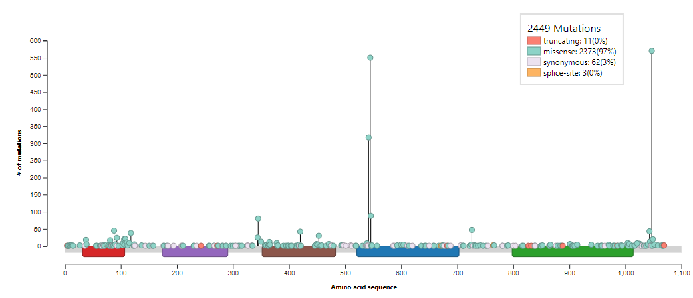

### Цели : 

Рассмотреть [базу генов рака](http://ncg.kcl.ac.uk/download.php) и выполнить следующие задания:

##### Задание 1:
  1. Найти выбранный ген в базе данных IntOGen. Типы рака, в которых он мутировал? Определить их типы – точечные или структурные (вставки, делиции, транслокации)? Включить скриншот с графическим поиском в отчет.
  2. Произвести поиск выбранного гена на портале [ICGC](https://dcc.icgc.org/): В каких типах рака выбранный ген мутирует?
  
##### Задание 2:  
  1. Скачать с [ICGC](https://dcc.icgc.org/) индивидуальный геном с мутациями
  2. В Data Repository выбрать SSM и рассмотреть координаты одноточечных мутаций для выбранного образца, проверить наличие мутаций в выбранном гене, приложить скриншот.
  3. Рассмотреть 2 пункт еще для 4 генов
  
### Обработка:

Загрузим используемые библиотеки

```{r setoptions & load_library, warning=FALSE,message=FALSE}
knitr::opts_chunk$set(echo = TRUE)

library(data.table)
library(DT)
```

Скачиваем список генов с [NCG](http://ncg.kcl.ac.uk/download.php) и читаем его

```{r read}
data <- as.data.frame(fread("NCG6_cancergenes.tsv"))
DT::datatable(data)
```
<br/>
Мы выбрали ген PIK3CA, и нашли его в [IntOGen](https://www.intogen.org/search?gene=PIK3CA)<br/>
<br/>
У данного гена есть мутации связанные со многими типами рака:

```{r IntOGen Methods}
IntOGen_methods <- as.data.frame(fread("IntOGen-Methods-PIK3CA.tsv"))
DT::datatable(IntOGen_methods)
```
<br/>
Большая часть мутаций являются точечными (97% всех мутаций данного гена приходятся на missense-мутации, которые являются точечными), но также встречаются и структурные

```{r IntOGen mutations}
IntOGen_mutations <- as.data.frame(fread("IntOGen-Distribution-PIK3CA.tsv"))
DT::datatable(IntOGen_mutations)
```
<br/>
Далее откроем раздел мутаций рассматриваемого гена в [ICGC](https://dcc.icgc.org/genes/ENSG00000121879/mutations), и рассмотрим таблицу исследований различных типов рака, имеющие мутации в данном гене:

```{r ICGC mutations}
icgc_table <- as.data.frame(fread("ENSG00000121879_distribution_2021_05_08_01_01_35.tsv"))
DT::datatable(icgc_table)
```
<br/>
Рассмотрим донора [DO41337](https://dcc.icgc.org/donors/DO41337), его мы выбрали рассмотрев одно из исследований ([UCEC-US](https://dcc.icgc.org/projects/UCEC-US?donors=%7B%22size%22:50,%22from%22:151%7D)), в котором встречались мутации PIK3CA

```{r ICGC DO41337,warning=FALSE}
DO41337 <- as.data.frame(fread("DO41337.tsv"))
DT::datatable(DO41337)
```
<br/><br/>
У данного донора имеется 5 мутаций в рассматриваемом гене ([ENSG00000121879](https://dcc.icgc.org/genes/ENSG00000121879?mutations=%7B%22from%22:1%7D))

```{r PIK3CA}
DO41337Lines = readLines("DO41337.tsv")
sum(grepl(pattern = "ENSG00000121879", x = DO41337Lines))
```


Исследование [UCEC-US](https://dcc.icgc.org/projects/UCEC-US) рассматривало рак тела матки(endometrial cancer), а следовательно часть доноров данной выборки имеет мутации связанные с повышенным риском возникновения данного заболевания. Тогда мы можем рассмотреть еще 4 гена из [базы генов рака](http://ncg.kcl.ac.uk/download.php), чьи мутации связаны с данным видом рака (endometrial_cancer в поле cancer_type), например:
<br/><br/>
[ALPK2](https://dcc.icgc.org/genes/ENSG00000198796), у данного донора в этом гене можно наблюдать 7 мутаций,

```{r ALPK2}
sum(grepl(pattern = "ENSG00000198796", x = DO41337Lines))
```

[BCOR](https://dcc.icgc.org/genes/ENSG00000183337), наблюдаются 17 мутаций,

```{r BCOR}
sum(grepl(pattern = "ENSG00000183337", x = DO41337Lines))
```

[CCND1](https://dcc.icgc.org/genes/ENSG00000110092), наблюдаются 4 мутации,

```{r CCND1}
sum(grepl(pattern = "ENSG00000110092", x = DO41337Lines))
```

[ERBB2](https://dcc.icgc.org/genes/ENSG00000141736), наблюдаются 11 мутаций

```{r ERBB2}
sum(grepl(pattern = "ENSG00000141736", x = DO41337Lines))
```

